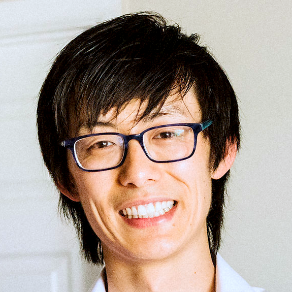
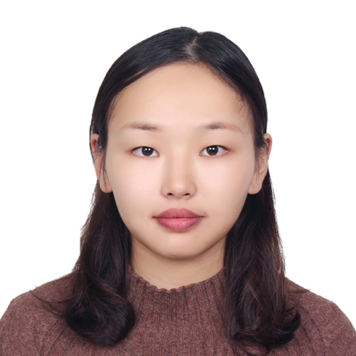

 

  <figure class="gallery__item gallery__item--11">
    
  </figure>
  <figure class="gallery__item gallery__item--12">
    
  </figure>
  <figure class="gallery__item gallery__item--13">
    
  </figure>
  <figure class="gallery__item gallery__item--14">
    
  </figure>
  <figure class="gallery__item gallery__item--15">
    
  </figure>

  <figure class="gallery__item gallery__item--21">
    
  </figure>
  <figure class="gallery__item gallery__item--22">
    
  </figure>
  <figure class="gallery__item gallery__item--23">
    
  </figure>
  <figure class="gallery__item gallery__item--24">
    
  </figure>
  <figure class="gallery__item gallery__item--25">
    
  </figure>
 

# Columbia University Database Research Group

Welcome to the Columbia University Database Research Group! We are interested in high-performance database architectures, web-scale information extraction, social media, data analysis, visualization tools, and database theory.

We are affiliated with the [Department of Computer Science](http://www.cs.columbia.edu) and the [Data Science Institute](http://datascience.columbia.edu).

<!--
## Seminar

The database group holds regular meetings Mondays 3-4:30PM in <a href="http://eugenewu.net/images/map.png" target="_blank">417 Mudd</a>.  We typically discuss a relevant paper or host outside speakers.  If you are interested in attending or speaking <a href="mailto:teffland@cs.columbia.edu" target="_blank">please get in contact with us</a>.

Below is a list of outside speakers.
-->

## News

<ul class="row">

<li><b>{{ n.date }}</b> : {{ n.news }}</li>

</ul> 
